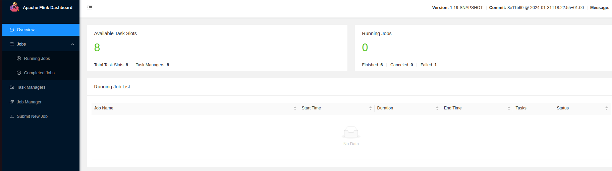
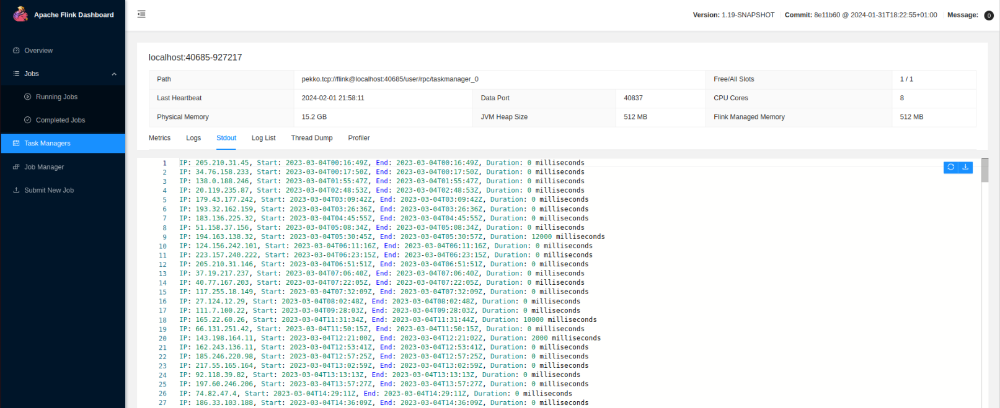

# Session Duration Calculator

This project is a Flink application that calculates the session duration for each IP address based on a given dataset. The session duration results are saved to a file for further analysis.

## Table of Contents
- [Introduction](#introduction)
- [Prerequisites](#prerequisites)
- [Installation](#installation)
- [Usage](#usage)
- [Dataset](#dataset)
- [Output](#output)

## Introduction

The Session Duration Calculator is a Flink application that processes a dataset containing IP addresses and timestamps and calculates the session duration for each IP address. It uses Flink's windowing and event time processing capabilities to group IP addresses into sessions and calculate the duration of each session.

The application reads the dataset from a CSV file, assigns timestamps to the events using watermarks, and then applies a tumbling window of 30 seconds to group events belonging to the same IP address. For each window, the session start time, session end time, and session duration are calculated and saved to a file.


## Prerequisites for Building Flink:

- Apache-Flink **GitHub Repository:** [https://github.com/apache/flink](https://github.com/apache/flink)
- Unix-like environment (Linux, Mac OS X, Cygwin, WSL)
- Git
- Maven (version 3.8.6 is required)
- Java 8 or 11 (Java 9 or 10 may work)

## Build Steps:

1. Clone the Flink repository:
   ```bash
   git clone https://github.com/apache/flink.git
   ```

2. Change to the Flink directory:
   ```bash
   cd flink
   ```

3. Build Flink using Maven (skip tests):
   ```bash
   ./mvnw clean package -DskipTests
   ```
   This process may take up to 10-15 minutes.

### IntelliJ IDEA Configuration:
1. Import `flink-dist_2.12-1.17-SNAPSHOT.jar`.
2. Import `flink-shaded-zookeeper-3-3.5.9-15.0.jar` (Attached with repo).


#### `Configure Flink by editing the conf/flink-conf.yaml file as needed. For local development, the default configuration should work fine.`


### Start the Flink cluster:

Execute the following command to start the Flink cluster:
```
./bin/start-cluster.sh
```
This command will start the JobManager and TaskManager processes locally.

### Verify the Flink cluster is running:

Open a web browser and visit the Flink Dashboard at http://localhost:8081.
The Flink Dashboard provides an overview of the running Flink cluster and allows you to monitor job execution.


###  Build code using Intellij IDEA :

After a successful build code using Intellij IDEA, you will find the JAR file ip.jar in the out directory.

## Usage

To use the Session Duration Calculator, follow these steps:


## Run the Flink job using the following command:

```
./bin/flink run -c Duration_Calculator /path/to/outputjarfile --datafile <path_to_input_file> --outputfile <path_to_output_file>
```
Replace /path/to/outputjarfile with the actual path to your output JAR file generated from the build process.
Replace <path_to_input_file> with the path to your input dataset file.
Replace <path_to_output_file> with the desired path for the output file.
Wait for the Flink job to complete. The session duration results will be saved to the specified output file.

#### Output Example 


